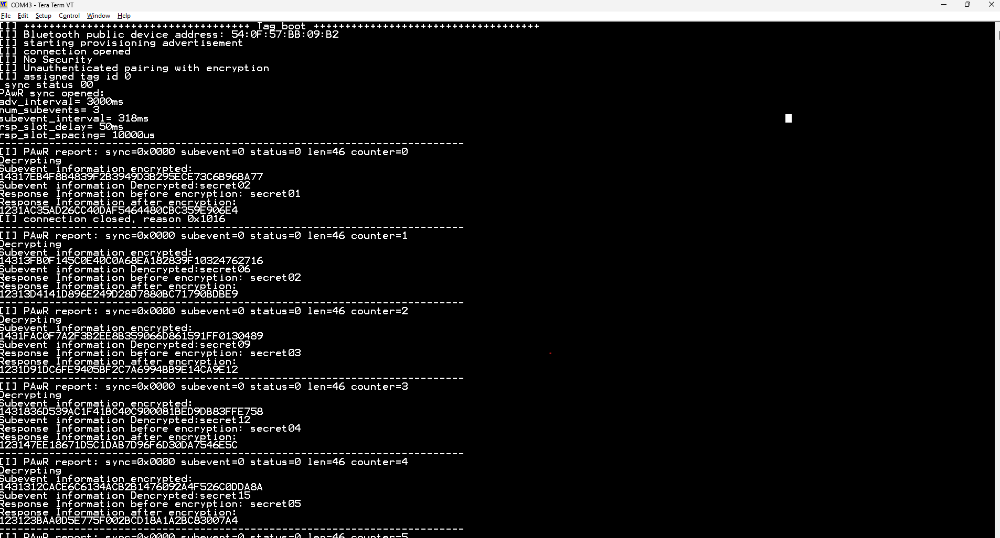
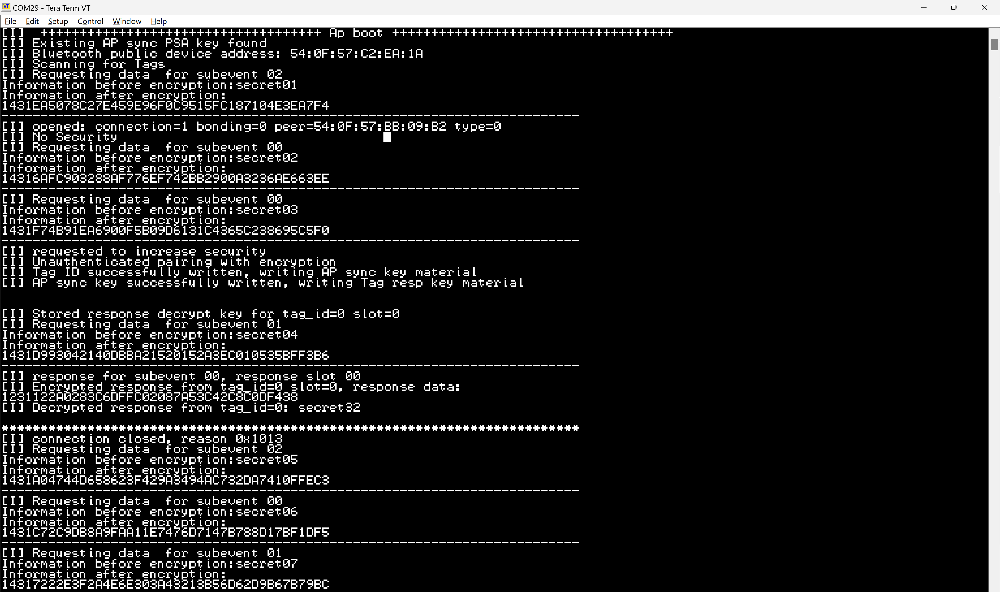

# Encrypted Periodic Advertising with Responses and PAST Example

## Description

This example demonstrates secure application-data exchange between one access point and multiple tags using Bluetooth LE Periodic Advertising with Responses (PAwR) Encrypted Advertising Data (EAD), and Periodic Advertising Synchronization Transfer (PAST).

The example consists of two projects:

- **Access point:** provisions tags, operates the PAwR advertiser, encrypts subevent data, and decrypts tag responses.
- **Tag:** advertises for provisioning, receives PAwR synchronization through PAST, decrypts its assigned subevent, and sends an encrypted response.

A temporary Bluetooth connection is used to provision each tag. After provisioning, the regular data exchange is connectionless and uses PAwR subevents and response slots.

### Access point

At boot, the access point initializes its EAD session, begins scanning for tags, and starts its PAwR train. It uses passive scanning on the 1M PHY and identifies tags by the custom **Secure Tag** service UUID included in their extended advertisements.

In this demonstration, a tag ID selects both the subevent to which the tag subscribes and the response slot in which it transmits. This one-to-one mapping is an application choice and can be changed as needed.

The following APIs perform the main access-point operations.

1. Configure and start scanning for tags:

```c
sl_bt_scanner_set_parameters(sl_bt_scanner_scan_mode_passive,
                             200,
                             200);

sl_bt_scanner_start(sl_bt_scanner_scan_phy_1m,
                    sl_bt_scanner_discover_observation);
```

2. Create an advertising set and start the PAwR advertiser:

```c
sl_bt_advertiser_create_set(&pawr_advertising_set_handle);

sl_bt_pawr_advertiser_start(pawr_advertising_set_handle,
                            PERIODIC_ADV_INTERVAL,
                            PERIODIC_ADV_INTERVAL,
                            0,
                            SUBEVENT_NUMBER,
                            SUBEVENT_INTERVAL,
                            RESPONSE_SLOT_DELAY,
                            RESPONSE_SLOT_SPACING,
                            RESPONSE_SLOT_NUMBER_PER_SUBVENT);
```

3. Connect to a discovered tag and provision it through GATT:

```c
sl_bt_connection_open(report->address,
                      report->address_type,
                      sl_bt_gap_phy_1m,
                      &connection_handle);

sl_bt_gatt_discover_primary_services_by_uuid(...);
sl_bt_gatt_discover_characteristics_by_uuid(...);
sl_bt_gatt_write_characteristic_value(...);
```

4. Transfer the PAwR synchronization information to the tag using PAST:

```c
sl_bt_advertiser_past_transfer(connection_handle,
                               0,
                               pawr_advertising_set_handle);
```

5. Encrypt and provide data for each requested PAwR subevent:

```c
sl_bt_ead_randomizer_update(&nonce);
sl_bt_ead_encrypt(...);
sl_bt_ead_pack_ad_data(...);

sl_bt_pawr_advertiser_set_subevent_data(req.advertising_set,
                                        subevent_index,
                                        0,
                                        RESPONSE_SLOT_NUMBER_PER_SUBVENT,
                                        advertisement_len,
                                        advertisement_buffer);
```

When a response report is received, the access point uses the response slot to locate the associated tag record and tag-specific key. It unpacks and decrypts the response using `sl_bt_ead_unpack_ad_data()` and `sl_bt_ead_decrypt()`.

The access point periodically checks its tag records. A tag without a successfully decrypted response for 30 seconds is marked stale, allowing its ID and response key slot to be reused.

### Tag

At boot, the tag configures itself to synchronize when PAST information is received. It then starts connectable extended advertising. The tag's GATT database advertises the custom [Secure Tag service](config/gatt_configuration.btconf#L51), which contains:

- **Tag ID:** the identifier assigned by the access point.
- **AP Sync Key Material:** the EAD session key and initialization vector used to decrypt access-point subevent data.
- **Tag Response Key Material:** the tag-specific EAD session key and initialization vector used to encrypt responses.

The following APIs perform the main tag operations.

1. Configure automatic synchronization from received PAST information:

```c
sl_bt_past_receiver_set_default_sync_receive_parameters(
  sl_bt_past_receiver_mode_synchronize,
  PERIODIC_SYNC_SKIP,
  PERIODIC_SYNC_TIMEOUT,
  sl_bt_sync_report_all);
```

2. Start connectable extended advertising for discovery and provisioning:

```c
sl_bt_advertiser_create_set(&advertising_set_handle);
sl_bt_extended_advertiser_generate_data(
  advertising_set_handle,
  sl_bt_advertiser_general_discoverable);

sl_bt_extended_advertiser_start(
  advertising_set_handle,
  sl_bt_extended_advertiser_connectable,
  0);
```

3. After receiving the PAST transfer, subscribe to the subevent assigned by the tag ID:

```c
sl_bt_pawr_sync_set_sync_subevents(
  pawr_handle,
  sizeof(subevents_subscription_list),
  subevents_subscription_list);
```

4. Decrypt the received subevent data and prepare an encrypted response:

```c
sl_bt_ead_unpack_ad_data(...);
sl_bt_ead_decrypt(...);
sl_bt_ead_randomizer_update(&tag_resp_nonce);
sl_bt_ead_encrypt(...);
sl_bt_ead_pack_ad_data(...);
```

5. Send the response in the slot assigned to the tag:

```c
sl_bt_pawr_sync_set_response_data(pawr_handle,
                                  sync_report->event_counter,
                                  sync_report->subevent,
                                  sync_report->subevent,
                                  tag_id,
                                  secret_data_len,
                                  response_buffer);
```

If the tag loses PAwR synchronization while it is disconnected, a periodic timer causes it to resume connectable advertising so that the access point can provision it again.

### Provisioning and synchronization sequence

1. The access point starts the PAwR train and scans for the Secure Tag service.
2. The tag starts connectable extended advertising.
3. The access point discovers the tag and opens a Bluetooth connection.
4. The access point discovers the Secure Tag service and its three characteristics.
5. The devices establish a bonded, encrypted LE Secure Connections link.
6. The access point assigns a tag ID.
7. The access point writes the shared AP synchronization key material.
8. The access point creates and writes unique response key material for the tag.
9. The access point transfers the PAwR synchronization information using PAST.
10. The access point records the tag as active and closes the connection.
11. The tag subscribes to the subevent corresponding to its assigned ID.
12. The devices continue exchanging encrypted data without a Bluetooth connection.

## Simplicity SDK version

- Simplicity SDK v2025.12.1

## Hardware required

- Two or more Wireless Starter Kit mainboards
- One Bluetooth-capable Series 2 radio board for the access point
- One Bluetooth-capable Series 2 radio board for each tag

At least two devices are required: one access point and one tag.

## Setting up

> **Note:** The provided projects already contain the required source files, software components, and configuration. The following steps are useful if you you are starting from the basic bluetooth empty

### Access point

1. Open Simplicity Studio v6 with Simplicity SDK v2025.12.1 or a compatible version.
2. generate a bluetooth empty project.
3. Verify that the following important software components are installed:
   - Extended Advertising
   - Scanner for extended advertisements
   - Periodic Advertising using PAwR trains
   - Transfer periodic synchronization information for a local advertising set
   - GATT Client
   - Security Manager
   - Encrypted Advertising Data Core
   - Log
4. Verify that [app.c](src/access_point/app.c), [main.c](src/access_point/main.c), and [app.h](inc/access_point/app.h) are included in the generated project.
5. Build and flash the project to the access-point device.
6. Open the serial console for the device. (make sure that you enable VCOM in the board control component)

### Tag

1. Open Simplicity Studio v6 with Simplicity SDK v2025.12.1 or a compatible version.
2. Verify that the following important software components are installed:
   - Extended Advertising
   - PAST Receiver
   - Synchronization to Periodic Advertising with Responses trains
   - GATT Server
   - Security Manager
   - Encrypted Advertising Data Core
   - Log
3. Insert [gatt_configuration.btconf](config/gatt_configuration.btconf) is the config/btconf directory
5. Verify that [app.c](src/tag/app.c), [main.c](src/tag/main.c), and [app.h](inc/tag/app.h) are included in the generated project.
6. Build and flash the project to the tag device.
7. Open the serial console for the device.(make sure that you enable VCOM in the board control component)

## Usage

1. Reset the access point. It prints its Bluetooth address, starts scanning for tags, and starts the PAwR train.
2. Reset a tag. It advertises the Secure Tag service.
3. The access point connects to the tag, assigns an ID, provisions the EAD keys, and transfers PAwR synchronization.
4. After the connection closes, the tag reports the received PAwR timing and synchronization state.
5. Observe the tag decrypting access-point messages and the access point decrypting tag responses.
6. Reset additional tags one at a time to provision multiple devices.

## Results

Below is the tag log, it shows:
- A boot sequence that starts advertising
- A connection with increased security
- Reception of an ID (also keys that are not logged here)
- Reception of the PAWR train and  connection close
- The subevent subscribed and the payload
- The response and its payload



Below is the access point log, it shows:
- A boot sequence that starts scanning for tags
- The stack requests to the application for the subevents data of the PAWR train
- A connection event with increased security
- GATT operation to write a tag ID, AP sync key and tag response key
- The response from the tag to subevent 0 in response slot 0


